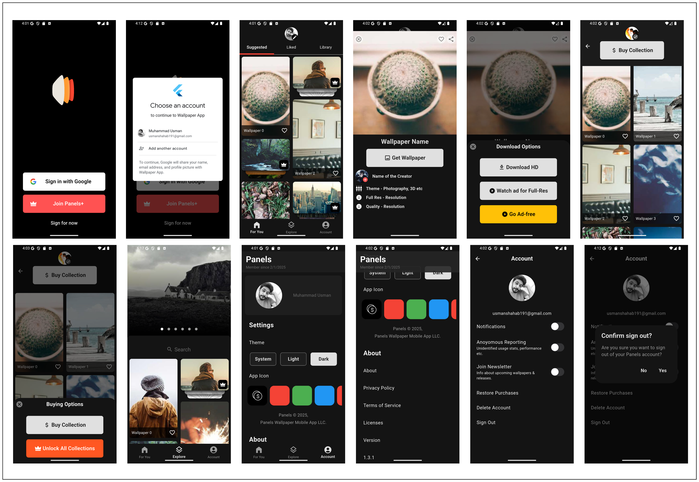

# Wallpaper App

A modern wallpaper application built with Flutter that allows users to explore, download, and manage wallpapers. The app features user authentication, theme customization, and a clean user interface.

## Features

### User Authentication:
- Sign in with Google
- User profile management
- Secure authentication using Supabase

### User Interface:
- Modern, responsive design
- Theme customization options
- Custom app icon selection
- Bottom navigation for easy access to key features

### Core Features:
- Wallpaper exploration
- Account management
- Theme switching
- Downloading Wallpapers [X]

### Settings & Preferences:
- Notifications [X]
- App icon customization [X]

## Project Structure

```bash
lib/
│
├── components/            # Reusable widgets and UI components
├── pages/                # Main app screens
│   ├── accounts_page.dart
│   ├── explore_page.dart
│   ├── home_page.dart
│   ├── main_page.dart
│   └── user_account_page.dart
├── service/              # Service layer
│   ├── auth/            # Authentication services
│   └── user_provider/   # User state management
└── main.dart            # Entry point of the application

assets/
│
├── fonts/               # Custom fonts (NotoSans)
├── images/             # Image assets
├── icons/              # App icons
└── animations/         # Animation files
```
## UI Screens


## Dependencies

- [provider](https://pub.dev/packages/provider) ^6.1.2
- [supabase_flutter](https://pub.dev/packages/supabase_flutter) ^2.8.3
- [flutter_dotenv](https://pub.dev/packages/flutter_dotenv) ^5.2.1
- [google_sign_in](https://pub.dev/packages/google_sign_in) ^6.2.2
- [flutter_staggered_grid_view](https://pub.dev/packages/flutter_staggered_grid_view) ^0.7.0
- [cached_network_image](https://pub.dev/packages/cached_network_image) ^3.4.1
- [flutter_svg](https://pub.dev/packages/flutter_svg) ^2.0.17
- [lottie](https://pub.dev/packages/lottie) ^3.3.1

## Getting Started

1. Clone the repository
```bash
git clone https://github.com/usman619/wallpaper_app.git
cd wallpaper_app
```
2. Install dependencies:
```bash
flutter pub get
```
3. Set up environmental variables in .env file
4. Run the app:
```bash
flutter run
```